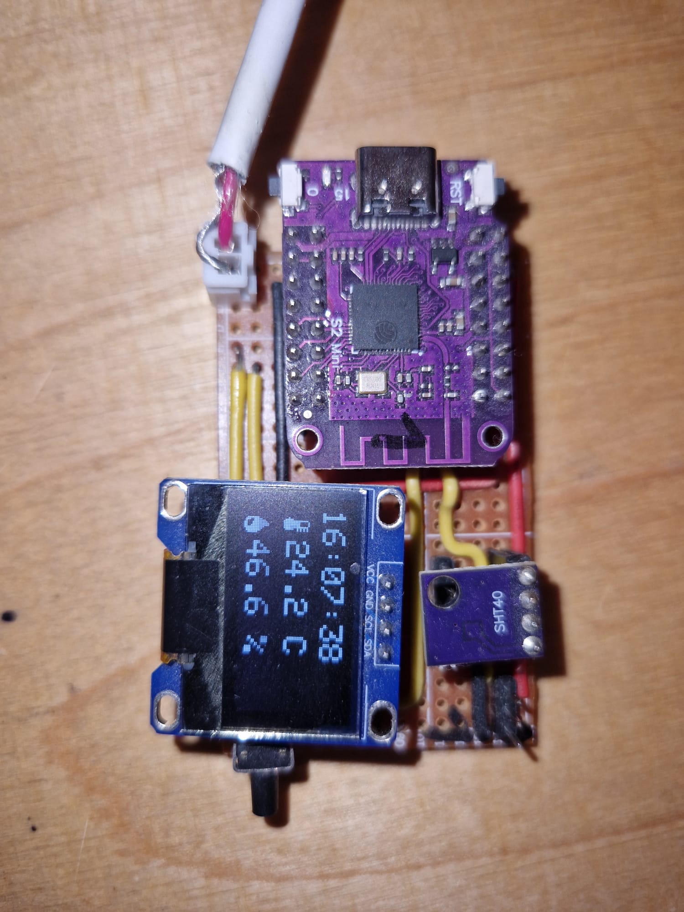

# ESP32 Smart Home Sensor Node

A ESP32-based smart home sensor client with sensors, OLED display, NTP time synchronization, and API integration for tracking and displaying environmental conditions. 

## Hardware 

### Required Components
- **Microcontroller**: ESP32-S2-Saola-1
- **Temperature/Humidity Sensor**: SHT40
- **Display**: SSD1306 OLED display (I2C)
- **Analog Input**: Soil moisture sensor (analog output)



<p>My prototype board on a stripboard.</p>

### Connections
```
I2C (SDA): GPIO 35
I2C (SCL): GPIO 33
Button: GPIO 8 (for display mode switching)
Analog Sensor: ADC1 Channel 1 (GPIO 2 on ESP32-S2-Saola-1)
```

## Software

### Client Node

- **PlatformIO**: Build and deployment tool
- **Arduino Framework**: C++ development environment
- **Libraries**:
  - Adafruit SSD1306 @ ^2.5.7
  - Adafruit SHT4X
  - ArduinoJson @ ^6.21.4

### Server Side

I am using this Node with an InfluxDB and API server, which is running via Docker on an OrangePI 5 that is in my LAN at home.

## Setup and Configuration

### 1. PlatformIO Setup

Install PlatformIO in VS Code or use the CLI:

```bash
# Clone the repository
git clone git@github.com:YOUR_USERNAME/esp32-smart-home-node.git
cd esp32-smart-home-node

# Install dependencies
pio install
```

### 2. WiFi Configuration

Create a `secrets.h` file in the `include/` directory based on the template:

```cpp
// include/secrets.h
#pragma once

#define WIFI_SSID "your_wifi_ssid"
#define WIFI_PASSWORD "your_wifi_password"
```

## Future Enhancements

- Low-power sleep modes for battery operation
- Multiple soil moisture sensors

## Acknowledgments

- Built with PlatformIO and Arduino framework
- Sensor libraries from Adafruit
- Time synchronization using built-in ESP32 SNTP client